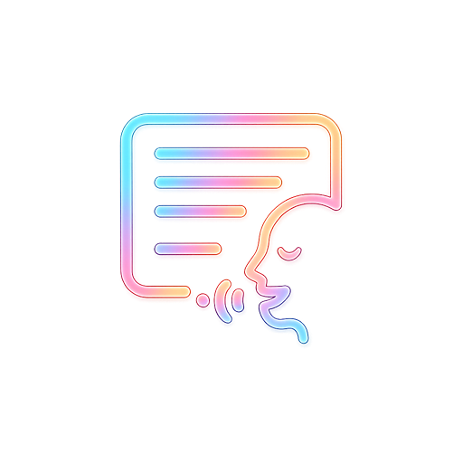

# 🎬 Tale Look - Smart Teleprompter Video Camera App

<p align="center">
  
</p>

<p align="center">
  <strong>The Ultimate Flutter Smart Teleprompter & Video Recording Application for Content Creators</strong>
</p>

<p align="center">
  
  
  
  
</p>

---

## 🌟 Overview (හඳුන්වාදීම)

**Tale Look** is a premium, high-performance Flutter mobile application designed specifically for content creators, vloggers, and presenters. It solves the biggest issue in self-recorded videos: **maintaining eye contact**. 

By displaying a smooth auto-scrolling script overlay directly over the live camera preview, positioned right next to the mobile camera lens, **Tale Look** ensures your eyes never drift away from the lens. It yields natural, high-impact video delivery every single time.

---

## 🚀 Key Features (ප්‍රධාන අංග)

*   **🎥 Dual-Layer UI Layout**:
    *   **Bottom Layer**: High-quality full-screen Camera Preview (supports front and rear camera toggling).
    *   **Top Layer**: Translucent black (#000000 with custom opacity) script container that doesn't block the visual recording path.
*   **👁️ Camera-Proximal Reading Zone**:
    *   Anchors and highlights the active reading lines at the absolute top of the screen (closest to the phone's front camera lens) to mimic natural eye contact.
*   **📜 Dynamic Auto-Scrolling Script**:
    *   Smooth, pixel-perfect vertical scrolling (bottom to top).
    *   Fully customizable text controls:
        *   **Speed Slider**: Adjust scrolling speed from slow reading to high-speed delivery.
        *   **Font Size Slider**: Dynamically resize text for comfortable readability.
        *   **Play/Pause Button**: Pause the script when ad-libbing and continue with a tap.
        *   **Restart Button**: Instantly jump back to the beginning of the script.
*   **✂️ Aspect Ratio Overlays**:
    *   Toggle overlay guides for different distribution channels:
        *   **TikTok / Reels** (9:16)
        *   **YouTube / Widescreen** (16:9)
        *   **Instagram Grid / Square** (1:1)
*   **💾 High-Definition Recording & Gallery Save**:
    *   Captures high-quality video and crystal-clear audio.
    *   Saves outputs directly to the native device's **Photos/Gallery** (as MP4) utilizing modern gallery access channels.
*   **🔤 Sinhala Unicode & Custom Font Support**:
    *   Fully integrated with the premium Sinhala Sangam Font (`SinhalaSangam`).
    *   Guarantees zero character breaking or rendering issues for Sinhala script readers.

---

## 🛠️ Technology Stack & Packages

*   **Framework**: Flutter (Dart)
*   **Camera Integration**: `camera` package for low-latency camera capturing.
*   **Video Gallery Exporter**: `gal` for secure, fast storage saves.
*   **English Typography**: `google_fonts` (Google Lexend typeface).
*   **Sinhala Typography**: Local embedded Sinhala Sangam Bold (`assets/fonts/sinhala-sangam-mn-bold(1).ttf`).

---

## 📁 Project Structure

```text
telelook/
├── android/               # Android native configuration (Camera & Storage Permissions)
├── ios/                   # iOS native configuration (Plist privacy strings)
├── assets/
│   └── fonts/
│       └── sinhala-sangam-mn-bold(1).ttf   # Custom Sinhala Unicode font
├── lib/
│   └── main.dart          # Core teleprompter camera app implementation
├── test/
│   └── widget_test.dart   # Smoke loading test suite
└── pubspec.yaml           # Assets, fonts, and packages configuration
```

---

## 📲 Installation & Setup (ස්ථාපනය කර ක්‍රියාත්මක කිරීම)

### Prerequisites
Make sure you have Flutter installed and configured on your system.

```bash
flutter --version
```

### Steps

1.  **Clone the Repository**:
    ```bash
    git clone https://github.com/RukshanAmodya/Tale-Look.git
    cd Tale-Look
    ```

2.  **Install Dependencies**:
    ```bash
    flutter pub get
    ```

3.  **Run the Project**:
    Connect an Android or iOS device (as camera features require physical hardware) and run:
    ```bash
    flutter run
    ```

---

## 🔒 Permissions Configured

Tale Look requests the following native permissions for smooth video recording:

*   **Camera Permission**: To show live viewfinder previews and record videos.
*   **Microphone Permission**: To record premium audio accompanying the video.
*   **Photo Library Access**: To save the finished MP4 file directly into the device's native Gallery.

---

## 🏷️ Metadata & Package Details

*   **App Name**: Tale Look
*   **Package Name**: `com.questrax.telelook`
*   **Author**: Rukshan Amodya

---

<p align="center">Made with ❤️ by Rukshan Amodya</p>
